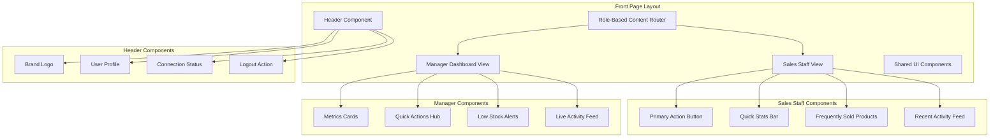

# Station Stock Manager - Front Page Design Document

## Overview

The Station Stock Manager front page will be completely refactored from the current generic SaaS template to a functional, role-based dashboard interface. The design prioritizes speed, clarity, and immediate access to core inventory management functions. The interface will serve as the primary working environment for both Sales Staff and Managers, with clean aesthetics that support functionality rather than overwhelming it.

## Architecture

### Component Structure



### Route Integration

The front page will replace the current marketing page structure:

**Current Structure (to be replaced):**
```
app/(unauthenticated)/(marketing)/page.tsx
├── HeroSection
├── CompaniesSection
├── VideoSection
├── FeaturesSection
├── SocialProofSection
├── PricingSection
├── FAQSection
└── CTASection
```

**New Structure:**
```
app/(authenticated)/dashboard/page.tsx (Manager View)
app/(authenticated)/staff/page.tsx (Staff View)
```

The unauthenticated marketing pages will be simplified to a basic login/signup flow.

## Components and Interfaces

### Header Component

**Design Specifications:**
- Clean white background with subtle shadow (`box-shadow: 0 1px 3px rgba(0,0,0,0.1)`)
- Fixed height of 64px for consistency
- Flexbox layout with space-between alignment

**Component Structure:**
```typescript
interface HeaderProps {
  user: {
    name: string
    role: 'staff' | 'manager'
    avatar?: string
  }
  connectionStatus: 'online' | 'offline'
  onLogout: () => void
}

const Header: React.FC<HeaderProps> = ({ user, connectionStatus, onLogout }) => {
  return (
    <header className="bg-white shadow-sm border-b border-gray-200 px-4 py-3">
      <div className="flex items-center justify-between max-w-7xl mx-auto">
        <div className="flex items-center">
          <h1 className="text-xl font-bold text-gray-900">Station Stock Manager</h1>
        </div>
        <div className="flex items-center space-x-4">
          <ConnectionStatus status={connectionStatus} />
          <UserProfile user={user} onLogout={onLogout} />
        </div>
      </div>
    </header>
  )
}
```

### Sales Staff View Components

#### Primary Action Button
```typescript
const PrimaryActionButton: React.FC = () => {
  return (
    <div className="mb-8">
      <button className="w-full bg-blue-600 hover:bg-blue-700 text-white font-bold py-6 px-8 rounded-lg shadow-lg transition-all duration-200 hover:shadow-xl">
        <div className="flex items-center justify-center space-x-3">
          <PlusIcon className="h-6 w-6" />
          <span className="text-xl">Record New Sale</span>
        </div>
      </button>
    </div>
  )
}
```

#### Quick Stats Bar
```typescript
interface QuickStatsProps {
  todaySales: number
  transactionCount: number
}

const QuickStatsBar: React.FC<QuickStatsProps> = ({ todaySales, transactionCount }) => {
  return (
    <div className="bg-gray-50 rounded-lg p-4 mb-6">
      <div className="grid grid-cols-2 gap-4">
        <div className="text-center">
          <p className="text-sm text-gray-600">My Sales Today</p>
          <p className="text-2xl font-bold text-gray-900">₦{todaySales.toLocaleString()}</p>
        </div>
        <div className="text-center">
          <p className="text-sm text-gray-600">Transactions</p>
          <p className="text-2xl font-bold text-gray-900">{transactionCount}</p>
        </div>
      </div>
    </div>
  )
}
```

#### Frequently Sold Products Grid
```typescript
interface Product {
  id: string
  name: string
  price: number
  stockLevel: 'high' | 'medium' | 'low'
}

const FrequentlysoldProducts: React.FC<{ products: Product[] }> = ({ products }) => {
  return (
    <div className="mb-6">
      <h3 className="text-lg font-semibold text-gray-900 mb-4">Frequently Sold</h3>
      <div className="grid grid-cols-2 md:grid-cols-3 gap-4">
        {products.map((product) => (
          <ProductCard key={product.id} product={product} />
        ))}
      </div>
    </div>
  )
}
```

### Manager Dashboard Components

#### Metrics Cards
```typescript
interface MetricCardProps {
  title: string
  value: string | number
  change?: number
  trend?: 'up' | 'down' | 'neutral'
  icon: React.ComponentType<{ className?: string }>
}

const MetricsCards: React.FC = () => {
  return (
    <div className="grid grid-cols-1 md:grid-cols-2 lg:grid-cols-4 gap-6 mb-8">
      <MetricCard
        title="Today's Sales"
        value="₦125,000"
        change={12.5}
        trend="up"
        icon={CurrencyNairaIcon}
      />
      <MetricCard
        title="Active Stock"
        value="24 Products"
        change={-2}
        trend="down"
        icon={CubeIcon}
      />
      <MetricCard
        title="Transactions"
        value="45"
        change={8.3}
        trend="up"
        icon={DocumentTextIcon}
      />
      <MetricCard
        title="Staff Active"
        value="3"
        trend="neutral"
        icon={UsersIcon}
      />
    </div>
  )
}
```

#### Quick Actions Hub
```typescript
const QuickActionsHub: React.FC = () => {
  const actions = [
    { title: 'Record Sale', icon: PlusIcon, color: 'bg-blue-600', href: '/sales' },
    { title: 'Add Stock', icon: ArrowUpIcon, color: 'bg-green-600', href: '/inventory/add' },
    { title: 'View Reports', icon: ChartBarIcon, color: 'bg-purple-600', href: '/reports' },
    { title: 'Manage Products', icon: CubeIcon, color: 'bg-orange-600', href: '/inventory' },
    { title: 'Staff Management', icon: UsersIcon, color: 'bg-indigo-600', href: '/users' },
    { title: 'End-of-Day Summary', icon: ClockIcon, color: 'bg-gray-600', href: '/reports/daily' }
  ]

  return (
    <div className="mb-8">
      <h3 className="text-lg font-semibold text-gray-900 mb-4">Quick Actions</h3>
      <div className="grid grid-cols-2 md:grid-cols-3 gap-4">
        {actions.map((action) => (
          <ActionButton key={action.title} {...action} />
        ))}
      </div>
    </div>
  )
}
```

## Data Models

### Front Page Data Interfaces

```typescript
// User Profile Data
interface UserProfile {
  id: string
  name: string
  username: string
  role: 'staff' | 'manager'
  avatar?: string
  stationId: string
  isActive: boolean
}

// Sales Staff Dashboard Data
interface StaffDashboardData {
  user: UserProfile
  todayStats: {
    salesAmount: number
    transactionCount: number
  }
  frequentProducts: Array<{
    id: string
    name: string
    price: number
    stockLevel: 'high' | 'medium' | 'low'
    stockCount: number
  }>
  recentTransactions: Array<{
    id: string
    timestamp: Date
    productName: string
    quantity: number
    amount: number
  }>
}

// Manager Dashboard Data
interface ManagerDashboardData {
  user: UserProfile
  metrics: {
    todaySales: {
      amount: number
      change: number
      trend: 'up' | 'down' | 'neutral'
    }
    activeStock: {
      count: number
      lowStockCount: number
    }
    transactions: {
      count: number
      change: number
    }
    activeStaff: {
      count: number
      totalStaff: number
    }
  }
  lowStockAlerts: Array<{
    productId: string
    productName: string
    currentStock: number
    minThreshold: number
    urgency: 'critical' | 'warning'
  }>
  recentActivity: Array<{
    id: string
    timestamp: Date
    staffName: string
    action: string
    details: string
  }>
}

// Connection Status
interface ConnectionStatus {
  status: 'online' | 'offline'
  lastSync?: Date
  pendingTransactions?: number
}
```

## Error Handling

### Connection Status Management

```typescript
const useConnectionStatus = () => {
  const [status, setStatus] = useState<'online' | 'offline'>('online')
  const [lastSync, setLastSync] = useState<Date | null>(null)

  useEffect(() => {
    const handleOnline = () => setStatus('online')
    const handleOffline = () => setStatus('offline')

    window.addEventListener('online', handleOnline)
    window.addEventListener('offline', handleOffline)

    return () => {
      window.removeEventListener('online', handleOnline)
      window.removeEventListener('offline', handleOffline)
    }
  }, [])

  return { status, lastSync }
}
```

### Error Boundary for Dashboard Components

```typescript
class DashboardErrorBoundary extends React.Component<
  { children: React.ReactNode },
  { hasError: boolean; error?: Error }
> {
  constructor(props: { children: React.ReactNode }) {
    super(props)
    this.state = { hasError: false }
  }

  static getDerivedStateFromError(error: Error) {
    return { hasError: true, error }
  }

  render() {
    if (this.state.hasError) {
      return (
        <div className="min-h-screen flex items-center justify-center bg-gray-50">
          <div className="text-center">
            <h2 className="text-xl font-semibold text-gray-900 mb-2">
              Something went wrong
            </h2>
            <p className="text-gray-600 mb-4">
              Please refresh the page or contact support if the problem persists.
            </p>
            <button
              onClick={() => window.location.reload()}
              className="bg-blue-600 text-white px-4 py-2 rounded-lg hover:bg-blue-700"
            >
              Refresh Page
            </button>
          </div>
        </div>
      )
    }

    return this.props.children
  }
}
```

## Testing Strategy

### Component Testing Approach

```typescript
// Example test for Sales Staff Dashboard
describe('StaffDashboard', () => {
  const mockStaffData: StaffDashboardData = {
    user: { id: '1', name: 'John Doe', role: 'staff', username: 'john', stationId: 'station-1', isActive: true },
    todayStats: { salesAmount: 45000, transactionCount: 12 },
    frequentProducts: [
      { id: '1', name: 'PMS', price: 650, stockLevel: 'high', stockCount: 1000 }
    ],
    recentTransactions: [
      { id: '1', timestamp: new Date(), productName: 'PMS', quantity: 10, amount: 6500 }
    ]
  }

  it('should display primary action button prominently', () => {
    render(<StaffDashboard data={mockStaffData} />)
    
    const recordSaleButton = screen.getByText('Record New Sale')
    expect(recordSaleButton).toBeInTheDocument()
    expect(recordSaleButton.closest('button')).toHaveClass('bg-blue-600')
  })

  it('should show today\'s sales statistics', () => {
    render(<StaffDashboard data={mockStaffData} />)
    
    expect(screen.getByText('₦45,000')).toBeInTheDocument()
    expect(screen.getByText('12')).toBeInTheDocument()
  })

  it('should display frequently sold products', () => {
    render(<StaffDashboard data={mockStaffData} />)
    
    expect(screen.getByText('PMS')).toBeInTheDocument()
    expect(screen.getByText('₦650')).toBeInTheDocument()
  })
})
```

### Integration Testing

```typescript
// Test role-based routing
describe('Front Page Routing', () => {
  it('should redirect staff users to staff dashboard', async () => {
    mockAuth.mockResolvedValue({ userId: 'user-123' })
    mockDb.query.users.findFirst.mockResolvedValue({ role: 'staff' })

    render(<FrontPage />)

    await waitFor(() => {
      expect(screen.getByText('Record New Sale')).toBeInTheDocument()
    })
  })

  it('should redirect manager users to manager dashboard', async () => {
    mockAuth.mockResolvedValue({ userId: 'user-123' })
    mockDb.query.users.findFirst.mockResolvedValue({ role: 'manager' })

    render(<FrontPage />)

    await waitFor(() => {
      expect(screen.getByText('Quick Actions')).toBeInTheDocument()
    })
  })
})
```

## Visual Design System

### Color Palette

```css
:root {
  /* Primary Colors */
  --color-primary-50: #eff6ff;
  --color-primary-600: #1e3a8a;
  --color-primary-700: #1e40af;

  /* Success Colors */
  --color-success-50: #f0fdf4;
  --color-success-600: #166534;
  --color-success-700: #15803d;

  /* Warning Colors */
  --color-warning-50: #fffbeb;
  --color-warning-600: #d97706;
  --color-warning-700: #b45309;

  /* Danger Colors */
  --color-danger-50: #fef2f2;
  --color-danger-600: #dc2626;
  --color-danger-700: #b91c1c;

  /* Neutral Colors */
  --color-gray-50: #f8fafc;
  --color-gray-100: #f1f5f9;
  --color-gray-600: #475569;
  --color-gray-900: #1f2937;
}
```

### Typography Scale

```css
.text-display {
  font-size: 2.25rem; /* 36px */
  line-height: 2.5rem; /* 40px */
  font-weight: 700;
}

.text-heading {
  font-size: 1.5rem; /* 24px */
  line-height: 2rem; /* 32px */
  font-weight: 600;
}

.text-body {
  font-size: 1rem; /* 16px */
  line-height: 1.5rem; /* 24px */
  font-weight: 400;
}

.text-caption {
  font-size: 0.875rem; /* 14px */
  line-height: 1.25rem; /* 20px */
  font-weight: 400;
}
```

### Component Spacing System

```css
.spacing-xs { margin: 0.25rem; } /* 4px */
.spacing-sm { margin: 0.5rem; }  /* 8px */
.spacing-md { margin: 1rem; }    /* 16px */
.spacing-lg { margin: 1.5rem; }  /* 24px */
.spacing-xl { margin: 2rem; }    /* 32px */
```

## Responsive Design Strategy

### Breakpoint System

```css
/* Mobile First Approach */
.container {
  padding: 1rem;
}

/* Tablet (768px and up) */
@media (min-width: 768px) {
  .container {
    padding: 1.5rem;
  }
  
  .grid-responsive {
    grid-template-columns: repeat(2, 1fr);
  }
}

/* Desktop (1024px and up) */
@media (min-width: 1024px) {
  .container {
    padding: 2rem;
    max-width: 1200px;
    margin: 0 auto;
  }
  
  .grid-responsive {
    grid-template-columns: repeat(3, 1fr);
  }
}
```

### Mobile Optimization

```typescript
const MobileOptimizedButton: React.FC<{ children: React.ReactNode }> = ({ children }) => {
  return (
    <button className="
      w-full 
      min-h-[44px] 
      bg-blue-600 
      text-white 
      font-semibold 
      rounded-lg 
      shadow-sm 
      active:bg-blue-700 
      transition-colors 
      duration-150
    ">
      {children}
    </button>
  )
}
```

This design document provides a comprehensive foundation for transforming the generic SaaS template into a functional, role-based inventory management interface that prioritizes usability, speed, and clarity for filling station operations.