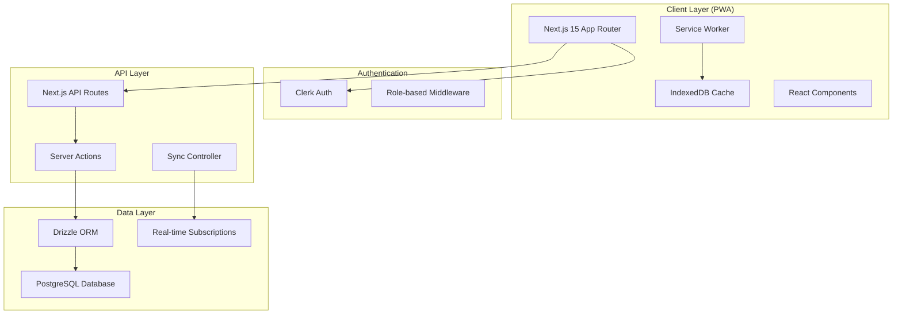

# Station Stock Manager - Design Document

## Overview

The Station Stock Manager will be built as a Progressive Web App (PWA) using the existing Next.js 15 SaaS template as the foundation. The application will transform the current template into a specialized inventory management system for filling stations, leveraging the existing authentication (Clerk), database (PostgreSQL + Drizzle), and payment infrastructure while adding comprehensive inventory management, offline capabilities, and role-based access control.

## Architecture

### High-Level Architecture



### Technology Stack Integration

**Frontend (PWA)**
- Next.js 15 with App Router (existing)
- React 19 with TypeScript (existing)
- Tailwind CSS + Shadcn UI (existing)
- Service Worker for offline functionality
- IndexedDB for local storage
- Workbox for PWA optimization

**Backend**
- Next.js API Routes (existing)
- Server Actions for data mutations (existing)
- PostgreSQL with Drizzle ORM (existing)
- Real-time subscriptions for live updates

**Authentication & Authorization**
- Clerk authentication (existing)
- Custom role-based middleware
- JWT tokens for offline authentication

## Components and Interfaces

### Database Schema Extensions

Building on the existing `customers` table, we'll add:

```typescript
// New tables for Station Stock Manager
export const stations = pgTable("stations", {
  id: uuid("id").defaultRandom().primaryKey(),
  customerId: uuid("customer_id").references(() => customers.id).notNull(),
  name: text("name").notNull(),
  address: text("address"),
  createdAt: timestamp("created_at").defaultNow().notNull(),
  updatedAt: timestamp("updated_at").defaultNow().notNull()
})

export const users = pgTable("users", {
  id: uuid("id").defaultRandom().primaryKey(),
  stationId: uuid("station_id").references(() => stations.id).notNull(),
  clerkUserId: text("clerk_user_id").unique().notNull(),
  username: text("username").unique().notNull(),
  role: userRole("role").notNull(),
  isActive: boolean("is_active").default(true).notNull(),
  createdAt: timestamp("created_at").defaultNow().notNull(),
  updatedAt: timestamp("updated_at").defaultNow().notNull()
})

export const products = pgTable("products", {
  id: uuid("id").defaultRandom().primaryKey(),
  stationId: uuid("station_id").references(() => stations.id).notNull(),
  name: text("name").notNull(),
  brand: text("brand"),
  type: productType("type").notNull(), // 'pms' | 'lubricant'
  viscosity: text("viscosity"), // For lubricants
  containerSize: text("container_size"), // For lubricants
  currentStock: decimal("current_stock", { precision: 10, scale: 2 }).notNull(),
  unitPrice: decimal("unit_price", { precision: 10, scale: 2 }).notNull(),
  minThreshold: decimal("min_threshold", { precision: 10, scale: 2 }).notNull(),
  unit: text("unit").notNull(), // 'litres' | 'units'
  isActive: boolean("is_active").default(true).notNull(),
  createdAt: timestamp("created_at").defaultNow().notNull(),
  updatedAt: timestamp("updated_at").defaultNow().notNull()
})

export const transactions = pgTable("transactions", {
  id: uuid("id").defaultRandom().primaryKey(),
  stationId: uuid("station_id").references(() => stations.id).notNull(),
  userId: uuid("user_id").references(() => users.id).notNull(),
  totalAmount: decimal("total_amount", { precision: 10, scale: 2 }).notNull(),
  transactionDate: timestamp("transaction_date").defaultNow().notNull(),
  syncStatus: syncStatus("sync_status").default("synced").notNull(),
  createdAt: timestamp("created_at").defaultNow().notNull()
})

export const transactionItems = pgTable("transaction_items", {
  id: uuid("id").defaultRandom().primaryKey(),
  transactionId: uuid("transaction_id").references(() => transactions.id).notNull(),
  productId: uuid("product_id").references(() => products.id).notNull(),
  quantity: decimal("quantity", { precision: 10, scale: 2 }).notNull(),
  unitPrice: decimal("unit_price", { precision: 10, scale: 2 }).notNull(),
  totalPrice: decimal("total_price", { precision: 10, scale: 2 }).notNull()
})

export const stockMovements = pgTable("stock_movements", {
  id: uuid("id").defaultRandom().primaryKey(),
  productId: uuid("product_id").references(() => products.id).notNull(),
  movementType: movementType("movement_type").notNull(), // 'sale' | 'adjustment' | 'delivery'
  quantity: decimal("quantity", { precision: 10, scale: 2 }).notNull(),
  previousStock: decimal("previous_stock", { precision: 10, scale: 2 }).notNull(),
  newStock: decimal("new_stock", { precision: 10, scale: 2 }).notNull(),
  reference: text("reference"), // Transaction ID or adjustment reason
  createdAt: timestamp("created_at").defaultNow().notNull()
})
```

### API Interfaces

**Authentication & User Management**
```typescript
// Server Actions
async function authenticateUser(username: string, password: string)
async function getUserRole(userId: string)
async function createStaffUser(userData: CreateUserData)
async function updateUserStatus(userId: string, isActive: boolean)
```

**Product Management**
```typescript
// Server Actions
async function getProducts(stationId: string, type?: 'pms' | 'lubricant')
async function createProduct(productData: CreateProductData)
async function updateProduct(productId: string, updates: UpdateProductData)
async function updateStock(productId: string, quantity: number, movementType: string)
```

**Sales & Transactions**
```typescript
// Server Actions
async function recordSale(saleData: CreateSaleData)
async function getSalesHistory(filters: SalesFilters)
async function voidTransaction(transactionId: string, reason: string)
async function syncOfflineTransactions(transactions: OfflineTransaction[])
```

**Reporting**
```typescript
// Server Actions
async function getDashboardMetrics(stationId: string, date: Date)
async function generateDailyReport(stationId: string, date: Date)
async function getStaffPerformance(stationId: string, dateRange: DateRange)
async function getLowStockAlerts(stationId: string)
```

### Component Architecture

**Route Structure**
```
/app
├── (unauthenticated)
│   ├── (auth)
│   │   ├── login/
│   │   └── signup/
│   └── (marketing)/ [existing]
├── (authenticated)
│   ├── dashboard/
│   │   ├── page.tsx [Manager Dashboard]
│   │   ├── sales/
│   │   │   ├── page.tsx [Sales Interface]
│   │   │   └── history/
│   │   ├── inventory/
│   │   │   ├── page.tsx [Product Management]
│   │   │   ├── products/
│   │   │   └── stock-movements/
│   │   ├── reports/
│   │   │   ├── page.tsx [Reports Dashboard]
│   │   │   ├── daily/
│   │   │   ├── weekly/
│   │   │   └── monthly/
│   │   ├── users/ [Manager Only]
│   │   └── settings/
│   └── staff/
│       ├── page.tsx [Staff Dashboard]
│       ├── sales/
│       └── summary/
└── api/
    ├── sync/
    ├── products/
    ├── transactions/
    └── reports/
```

**Key Components**

1. **SalesInterface Component**
   - Product type selector (PMS/Lubricants)
   - Searchable product list
   - Quantity input with validation
   - Price calculation display
   - Transaction confirmation

2. **DashboardMetrics Component**
   - Real-time metrics cards
   - Low stock alerts
   - Quick action buttons
   - Staff activity indicators

3. **ProductManager Component**
   - Product CRUD operations
   - Stock level management
   - Price updates
   - Threshold settings

4. **ReportGenerator Component**
   - Date range selection
   - Report type selection
   - Data visualization
   - Export functionality

5. **OfflineSync Component**
   - Sync status indicator
   - Queue management
   - Conflict resolution
   - Error handling

## Data Models

### Core Data Models

```typescript
interface Station {
  id: string
  customerId: string
  name: string
  address?: string
  createdAt: Date
  updatedAt: Date
}

interface User {
  id: string
  stationId: string
  clerkUserId: string
  username: string
  role: 'staff' | 'manager'
  isActive: boolean
  createdAt: Date
  updatedAt: Date
}

interface Product {
  id: string
  stationId: string
  name: string
  brand?: string
  type: 'pms' | 'lubricant'
  viscosity?: string
  containerSize?: string
  currentStock: number
  unitPrice: number
  minThreshold: number
  unit: 'litres' | 'units'
  isActive: boolean
  createdAt: Date
  updatedAt: Date
}

interface Transaction {
  id: string
  stationId: string
  userId: string
  totalAmount: number
  transactionDate: Date
  syncStatus: 'pending' | 'synced' | 'failed'
  items: TransactionItem[]
  createdAt: Date
}

interface TransactionItem {
  id: string
  transactionId: string
  productId: string
  quantity: number
  unitPrice: number
  totalPrice: number
  product?: Product
}

interface StockMovement {
  id: string
  productId: string
  movementType: 'sale' | 'adjustment' | 'delivery'
  quantity: number
  previousStock: number
  newStock: number
  reference?: string
  createdAt: Date
}
```

### Offline Data Models

```typescript
interface OfflineTransaction {
  tempId: string
  stationId: string
  userId: string
  items: OfflineTransactionItem[]
  totalAmount: number
  timestamp: Date
  syncAttempts: number
}

interface SyncQueue {
  transactions: OfflineTransaction[]
  lastSyncAttempt: Date
  pendingCount: number
  failedCount: number
}

interface CachedData {
  products: Product[]
  userProfile: User
  lastUpdated: Date
  version: string
}
```

## Error Handling

### Client-Side Error Handling

1. **Network Errors**
   - Automatic retry with exponential backoff
   - Graceful degradation to offline mode
   - User notification of connectivity status

2. **Validation Errors**
   - Real-time form validation
   - Clear error messages
   - Prevention of invalid data submission

3. **Sync Conflicts**
   - Conflict detection and resolution
   - User notification of conflicts
   - Manual resolution interface when needed

### Server-Side Error Handling

1. **Database Errors**
   - Transaction rollback on failures
   - Detailed error logging
   - Graceful error responses

2. **Authentication Errors**
   - Secure error messages
   - Session management
   - Role-based access validation

3. **Business Logic Errors**
   - Stock validation (prevent negative stock)
   - Price validation
   - User permission validation

## Testing Strategy

### Unit Testing
- Component testing with React Testing Library
- Server Action testing with Jest
- Database operation testing
- Utility function testing

### Integration Testing
- API endpoint testing
- Database integration testing
- Authentication flow testing
- Offline sync testing

### End-to-End Testing
- User journey testing with Playwright
- Cross-browser PWA testing
- Offline functionality testing
- Role-based access testing

### Performance Testing
- PWA performance auditing
- Database query optimization
- Offline storage limits testing
- Sync performance testing

## PWA Implementation Details

### Service Worker Strategy
```typescript
// Service Worker registration and caching strategy
const CACHE_NAME = 'station-stock-v1'
const OFFLINE_CACHE = 'offline-data-v1'

// Cache-first strategy for static assets
// Network-first strategy for API calls
// Background sync for offline transactions
```

### Offline Storage Strategy
- **IndexedDB**: Transaction queue, product catalog, user data
- **LocalStorage**: User preferences, app settings
- **Cache API**: Static assets, API responses

### Sync Strategy
- **Background Sync**: Automatic sync when online
- **Periodic Sync**: Regular data updates
- **Manual Sync**: User-triggered sync option
- **Conflict Resolution**: Last-write-wins with user override option

### PWA Manifest
```json
{
  "name": "Station Stock Manager",
  "short_name": "StockManager",
  "description": "Inventory management for filling stations",
  "start_url": "/dashboard",
  "display": "standalone",
  "background_color": "#ffffff",
  "theme_color": "#000000",
  "icons": [
    {
      "src": "/icons/icon-192.png",
      "sizes": "192x192",
      "type": "image/png"
    },
    {
      "src": "/icons/icon-512.png",
      "sizes": "512x512",
      "type": "image/png"
    }
  ]
}
```

This design leverages the existing Next.js SaaS template infrastructure while adding the specialized functionality needed for filling station inventory management. The PWA capabilities ensure the app works reliably in environments with poor connectivity, while the role-based access control provides appropriate security and functionality separation between staff and management users.